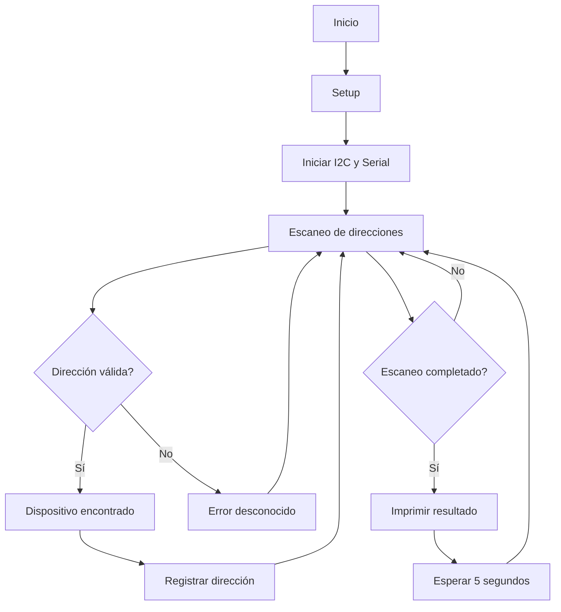
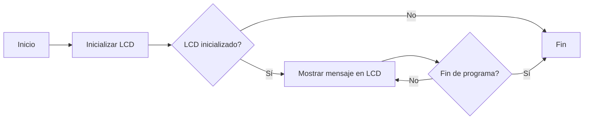

# Práctica 5: Comunicación I2C

### Objetivos
El objetivo es adquirir un conocimiento profundo sobre el funcionamiento de los buses de comunicación que permiten la interacción entre periféricos, tanto internos como externos al procesador. Como parte de esta comprensión, se desarrollará un escáner capaz de identificar los dispositivos conectados a un bus I2C. Además, se implementará un sistema que permita visualizar información en una pantalla OLED utilizando dicho protocolo de comunicación, integrando así teoría y práctica en el manejo de dispositivos electrónicos mediante I2C.

### Materiales
Para el desarrollo del proyecto se utilizará un microcontrolador ESP32-S3 como plataforma principal, debido a su capacidad de manejo de periféricos y compatibilidad con múltiples interfaces de comunicación. Se trabajará con distintos dispositivos que utilicen la interfaz I2C, lo que permitirá explorar y poner en práctica la detección e interacción con estos componentes. En la segunda parte del proyecto, se empleará un display OLED basado en el controlador SSD1306, el cual será utilizado para mostrar información a través del protocolo I2C, consolidando así la integración entre el microcontrolador y dispositivos externos.

## Parte 1
### Descripción
Este programa está diseñado para detectar dispositivos conectados al bus I2C utilizando un microcontrolador ESP32-S3. Mediante la función loop(), se realiza un recorrido por todas las direcciones I2C posibles (desde la 1 hasta la 127), intentando establecer comunicación con cada una de ellas. Cuando un dispositivo responde, su dirección es registrada y mostrada a través del puerto serie, lo que permite identificar los componentes conectados al bus.

#### Código
```cpp
#include <Arduino.h>
#include <Wire.h>
void setup()
{
Wire.begin();
Serial.begin(115200);
while (!Serial);
Serial.println("\nI2C Scanner");
}
void loop()
{
byte error, address;
int nDevices;
Serial.println("Scanning...");
nDevices = 0;
for(address = 1; address < 127; address++ )
{
Wire.beginTransmission(address);
error = Wire.endTransmission();
if (error == 0)
{
Serial.print("I2C device found at address 0x");
if (address<16)
Serial.print("0");
Serial.print(address,HEX);
Serial.println(" !");
nDevices++;
}
else if (error==4)
{
Serial.print("Unknown error at address 0x");
if (address<16)
Serial.print("0");
Serial.println(address,HEX);
}
}
if (nDevices == 0)
Serial.println("No I2C devices found\n");
else
Serial.println("done\n");
delay(5000);
}
```


### Output puerto serie
Ejemplo de salida si se encuentran dispositivos:
```
Scanning...
I2C device found at address 0x27 !
done
```
Si no se encuentran dispositivos:
```
Scanning...
No I2C devices found
```

## Diagrama


---

## Parte 2
### Descripción
Este código permite utilizar una pantalla OLED conectada mediante el protocolo I2C para visualizar un mensaje en su pantalla. A través de la comunicación con el controlador del display, se envía el contenido que se desea mostrar, facilitando así la presentación de información de manera clara y accesible..

### Código

```cpp
#include <Wire.h>
#include <Adafruit_GFX.h>
#include <Adafruit_SSD1306.h>

// Definir las dimensiones del OLED y la dirección I2C
#define SCREEN_WIDTH 128
#define SCREEN_HEIGHT 64
#define OLED_RESET -1 // No utilizamos un pin de reset
Adafruit_SSD1306 display(SCREEN_WIDTH, SCREEN_HEIGHT, &Wire, OLED_RESET);

void setup() {
  Serial.begin(115200); // Inicializar comunicación serie

  // Inicializar la comunicación I2C en los pines SDA (21) y SCL (20) para ESP32
  Wire.begin(21, 20); // Usa los pines 21 (SDA) y 20 (SCL)

  // Inicializar el display OLED con la dirección I2C 0x3C
  if (!display.begin(SSD1306_SWITCHCAPVCC, 0x3C)) {
    Serial.println(F("No se pudo encontrar un display OLED"));
    for (;;); // Detener el programa si no se encuentra el display
  }

  // Limpiar la pantalla
  display.clearDisplay();
  display.setTextSize(1);
  display.setTextColor(SSD1306_WHITE);
  display.setCursor(0, 0);

  // Mostrar mensaje inicial
  display.println(F("Escaneando dispositivos I2C..."));
  display.display();
  delay(1000);
}

void loop() {
  byte error, address;
  int nDevices = 0;

  display.clearDisplay(); // Limpiar la pantalla antes de mostrar resultados
  display.setCursor(0, 0); // Ubicar el cursor en la parte superior

  // Escanear direcciones I2C de 1 a 126
  for (address = 1; address < 127; address++) {
    Wire.beginTransmission(address);
    error = Wire.endTransmission();

    if (error == 0) {
      // Si se encuentra un dispositivo, mostrar su dirección en hexadecimal
      display.print(F("Dispositivo I2C en: 0x"));
      if (address < 16) display.print("0"); // Asegurarse de que la dirección tiene 2 dígitos
      display.println(address, HEX); // Mostrar dirección en formato hexadecimal
      nDevices++;
    } else if (error == 4) {
      // Error desconocido
      display.print(F("Error en: 0x"));
      if (address < 16) display.print("0");
      display.println(address, HEX);
    }
  }

  // Si no se encontraron dispositivos, mostrar mensaje correspondiente
  if (nDevices == 0) {
    display.println(F("No se encontraron dispositivos"));
  } else {
    display.println(F("Escaneo completado"));
  }

  display.display(); // Actualizar pantalla con los resultados
  delay(5000); // Esperar 5 segundos antes de hacer otro escaneo
}
```

En la segunda parte de la practica, el escáner I2C se modifica para que las direcciones detectadas se muestren en una pantalla OLED SSD1306 en lugar de utilizar el monitor serie. Para ello, se emplea la librería Adafruit_SSD1306.h, que facilita la comunicación con el display a través del protocolo I2C. La pantalla se inicializa en la dirección I2C 0x3C y, al comenzar la ejecución, despliega un mensaje de inicio. Posteriormente, el bucle principal realiza el escaneo de direcciones I2C y presenta los resultados directamente en la pantalla OLED. En caso de no encontrar dispositivos conectados, se muestra el mensaje "No hay dispositivos I2C", permitiendo así una visualización clara y autónoma de los dispositivos detectados.

### Código para mostrar un mensaje a medida en la pantalla OLED:
```cpp
#include <Wire.h>
#include <Adafruit_GFX.h>
#include <Adafruit_SSD1306.h>


#define SCREEN_WIDTH 128
#define SCREEN_HEIGHT 64
#define OLED_RESET -1 // No estamos usando un pin de reset
Adafruit_SSD1306 display(SCREEN_WIDTH, SCREEN_HEIGHT, &Wire, OLED_RESET);


void setup() {
  Serial.begin(115200);


  // Inicializar la comunicación I2C en los pines 21 (SDA) y 20 (SCL)
  Wire.begin(21, 20);
  
  // Inicializar el display con la dirección I2C 0x3C (o 0x3D dependiendo de tu pantalla)
  if (!display.begin(SSD1306_SWITCHCAPVCC, 0x3C)) {
    Serial.println(F("No se pudo encontrar un display OLED"));
    for (;;); // Detener el programa si no se encuentra el display
  }


  // Limpiar la pantalla
  display.clearDisplay();


  // Configurar el texto en la pantalla
  display.setTextSize(2);
  display.setTextColor(SSD1306_WHITE);
  display.setCursor(0, 0);
  display.print(F("¡Daniel y Mireia!"));
  display.display();
}


void loop() {
  // Lo que quieras actualizar en la pantalla
}
```

Por último, la pantalla OLED muestra un mensaje fijo de bienvenida con una fuente más grande. El código solo configura el display y muestra el texto, sin escanear dispositivos I2C.

## Diagrama


---

## Conclusiones
Se logró detectar con éxito los dispositivos conectados al bus I2C, lo que facilita la identificación de posibles fallos en las conexiones y el reconocimiento de las direcciones de los periféricos involucrados. Además, se desarrolló un sistema que utiliza un display OLED para mostrar información a través del protocolo I2C, permitiendo una visualización clara y eficiente de los datos. En general, la comunicación I2C se confirma como una herramienta fundamental en la interconexión de componentes en sistemas embebidos, ya que posibilita la integración de múltiples sensores y actuadores empleando un número reducido de conexiones físicas.

# Ejercicio de mejora de nota

## Parte 1
```cpp
#include <Wire.h>
#include <Adafruit_GFX.h>
#include <Adafruit_SSD1306.h>
#include "MAX30105.h"
#include "spo2_algorithm.h"

// Definir los pines I2C personalizados para ESP32-S3
#define SDA_PIN 21  
#define SCL_PIN 22

// Configuración OLED
#define SCREEN_WIDTH 128
#define SCREEN_HEIGHT 64
Adafruit_SSD1306 display(SCREEN_WIDTH, SCREEN_HEIGHT, &Wire, -1);

// Sensor MAX30105
MAX30105 particleSensor;
uint32_t irBuffer[100], redBuffer[100];
int32_t spo2, heartRate;
int8_t validSPO2, validHeartRate;

void setup() {
  Serial.begin(115200);
  Wire.begin(SDA_PIN, SCL_PIN);  // Configurar I2C

  // Iniciar pantalla OLED
  if (!display.begin(SSD1306_SWITCHCAPVCC, SCREEN_ADDRESS)) {
    Serial.println("Fallo en OLED SSD1306");
    while (1);
  }
  display.clearDisplay();
  display.setTextSize(1);
  display.setTextColor(SSD1306_WHITE);
  display.setCursor(0, 0);
  display.println("Iniciando...");
  display.display();

  // Iniciar sensor MAX30105
  if (!particleSensor.begin(Wire, I2C_SPEED_STANDARD)) {
    Serial.println("Sensor MAX30105 no encontrado");
    while (1);
  }

  // Configuración optimizada para MAX30105
  particleSensor.setup(69, 4, 2, 100, 411, 4096);  // Configuración optimizada para HR + SpO2
}

void loop() {
  // Leer 100 muestras del sensor
  for (byte i = 0; i < 100; i++) {
    while (!particleSensor.available()) particleSensor.check();
    redBuffer[i] = particleSensor.getRed();
    irBuffer[i] = particleSensor.getIR();
    particleSensor.nextSample();
  }

  // Calcular SpO2 y HR
  maxim_heart_rate_and_oxygen_saturation(irBuffer, 100, redBuffer, &spo2, &validSPO2, &heartRate, &validHeartRate);

  // Mostrar en pantalla OLED
  display.clearDisplay();
  display.setCursor(0, 0);
  display.print("HR: ");
  display.println(validHeartRate ? String(heartRate) + " BPM" : "N/A");
  display.print("SpO2: ");
  display.println(validSPO2 ? String(spo2) + " %" : "N/A");
  display.display();

  Serial.print("HR: ");
  Serial.print(validHeartRate ? String(heartRate) + " BPM" : "N/A");
  Serial.print(" | SpO2: ");
  Serial.println(validSPO2 ? String(spo2) + " %" : "N/A");

  delay(1000);
}


```
El ESP32-S3 se configura para medir la frecuencia cardíaca y SpO₂ usando el sensor MAX30105, mostrando los resultados en una pantalla OLED SSD1306. La comunicación I2C se realiza por los pines SDA 21 y SCL 22, y se verifica el correcto funcionamiento de ambos dispositivos. Cada segundo se toman 100 lecturas de luz roja e infrarroja, que se procesan para calcular los valores y se actualizan en la pantalla y el monitor serie.


## Parte 2
```cpp
#include <WiFi.h>
#include <Wire.h>
#include <Adafruit_GFX.h>
#include <Adafruit_SSD1306.h>
#include "MAX30105.h"
#include "spo2_algorithm.h"

// Configuración WiFi
const char* ssid = "Nautilus";     
const char* password = "20000Leguas"; 

// Servidor Web
WiFiServer server(80);

// Configuración OLED
#define SCREEN_WIDTH 128
#define SCREEN_HEIGHT 64
Adafruit_SSD1306 display(SCREEN_WIDTH, SCREEN_HEIGHT, &Wire, -1);

// Sensor MAX30105
MAX30105 particleSensor;
uint32_t irBuffer[100], redBuffer[100];
int32_t spo2, heartRate;
int8_t validSPO2, validHeartRate;

// Pines I2C para ESP32-S3
#define SDA_PIN 21 
#define SCL_PIN 22 

void setup() {
  Serial.begin(115200);
  Wire.begin(SDA_PIN, SCL_PIN);

  // Conexión a WiFi
  WiFi.begin(ssid, password);
  Serial.print("Conectando a WiFi");
  while (WiFi.status() != WL_CONNECTED) {
    delay(500);
    Serial.print(".");
  }
  Serial.println("\nWiFi conectado!");
  Serial.print("IP: ");
  Serial.println(WiFi.localIP());
  server.begin();

  // Iniciar OLED
  if (!display.begin(SSD1306_SWITCHCAPVCC, SCREEN_ADDRESS)) {
    Serial.println("Fallo en OLED");
    while (1);
  }
  display.clearDisplay();
  display.setTextSize(1);
  display.setTextColor(SSD1306_WHITE);
  display.setCursor(0, 0);
  display.println("Iniciando...");
  display.display();

  // Iniciar sensor MAX30105
  if (!particleSensor.begin(Wire, I2C_SPEED_STANDARD)) {
    Serial.println("Sensor MAX30105 no encontrado");
    while (1);
  }
  particleSensor.setup(69, 4, 2, 100, 411, 4096);
}

void loop() {
  // Manejar clientes web
  WiFiClient client = server.available();
  if (client) {
    String request = client.readStringUntil('\r');
    client.flush();

    // Enviar datos al cliente
    String response = "HTTP/1.1 200 OK\r\nContent-Type: text/html\r\n\r\n";
    response += "<!DOCTYPE html><html><head><meta http-equiv='refresh' content='1'>";
    response += "<style>body{font-family:Arial;text-align:center;} .data{font-size:2em;color:blue;}</style>";
    response += "</head><body>";
    response += "<h2>Monitor de Frecuencia Cardiaca y SpO2</h2>";
    response += "<p>Frecuencia Cardiaca: <span class='data'>" + String(validHeartRate ? String(heartRate) + " BPM" : "N/A") + "</span></p>";
    response += "<p>SpO2: <span class='data'>" + String(validSPO2 ? String(spo2) + " %" : "N/A") + "</span></p>";
    response += "</body></html>";

    client.print(response);
    client.stop();
  }

  // Leer datos del sensor
  for (byte i = 0; i < 100; i++) {
    while (!particleSensor.available()) particleSensor.check();
    redBuffer[i] = particleSensor.getRed();
    irBuffer[i] = particleSensor.getIR();
    particleSensor.nextSample();
  }

  maxim_heart_rate_and_oxygen_saturation(irBuffer, 100, redBuffer, &spo2, &validSPO2, &heartRate, &validHeartRate);

  // Mostrar en OLED
  display.clearDisplay();
  display.setCursor(0, 0);
  display.print("HR: ");
  display.println(validHeartRate ? String(heartRate) + " BPM" : "N/A");
  display.print("SpO2: ");
  display.println(validSPO2 ? String(spo2) + " %" : "N/A");
  display.display();

  // Mostrar en Monitor Serie
  Serial.print("HR: ");
  Serial.print(validHeartRate ? String(heartRate) + " BPM" : "N/A");
  Serial.print(" | SpO2: ");
  Serial.println(validSPO2 ? String(spo2) + " %" : "N/A");

  delay(1000);
}


```
El sensor y la pantalla OLED continúan funcionando, ahora con conexión WiFi. El ESP32 se conecta a una red mediante SSID y contraseña, y ejecuta un servidor web en el puerto 80. Cada segundo procesa solicitudes HTTP y genera una página con HTML y CSS que muestra los datos en tiempo real, permitiendo visualizar la frecuencia cardíaca y SpO₂ tanto en la OLED como en cualquier dispositivo conectado a la red.
